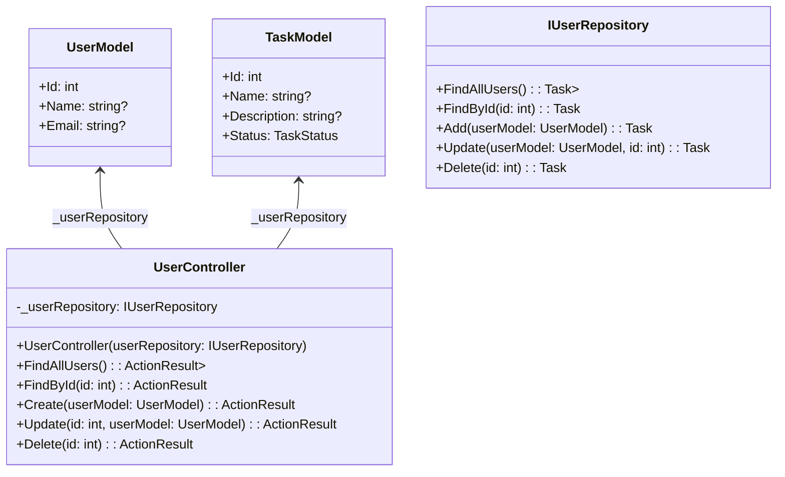

# taskSystem
manage tasks for users with swagger, ORM, postgres

#### Endpoints 
- GET /api/User
- POST /api/User
- GET /api/User/{id}
- PUT /api/User/{id}
- DELET /api/User/{id}

  | Endpoints | Route  |
|---|---|
| GET | **/listCars** |
| POST | **/api/User** |
| GET | **/api/User/{id}** |
| PUT | **/api/User/{id}** |
| DELETE | **/api/User/{id}** |

